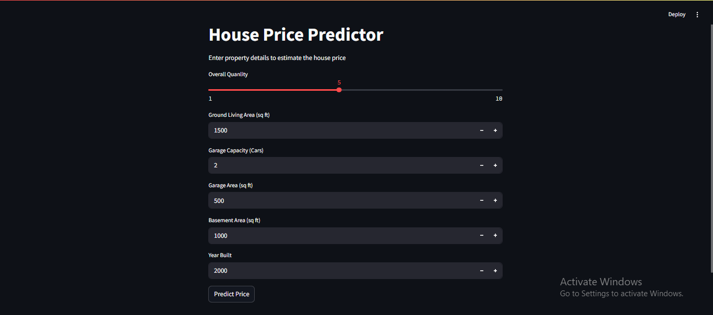
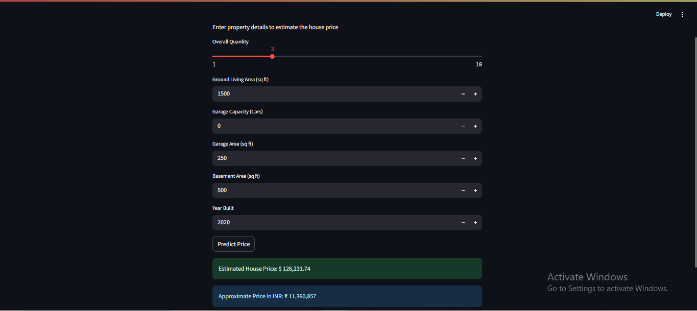

# Task 4 - House Price Prediction (BNM Tech Solutions)

## Project Overview
This project uses Machine Learning to predict house prices based on various property features. A Random Forest Regressor model was trained on housing data and deployed using Streamlit for real-time predictions.

**Dataset Source :** [House Price Prediction](https://www.kaggle.com/competitions/house-prices-advanced-regression-techniques/data) 

## Model Performance
- **MAE :** 19,601
- **RMSE :** 30,019
- **R² Score :** 0.825

The model explains approximately **82.5%** of the variation in house prices.

## Application Screenshots

### Home Page

### Prediction Result

